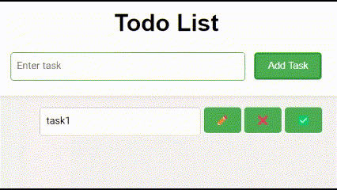
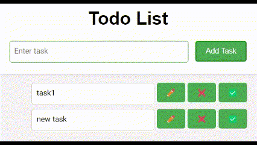

# Todo-List
A simple Todo List web application built with Flask, HTML, and CSS.


## Features

- Feature 1: Add Task
   
    <p align="center">  
    
    </p>   

- Feature 2: Delete Task
   
    <p align="center">  
    
    </p> 
  
- Feature 3: Edit Task
  
    <p align="center">  
    
    </p>
  
- Feature 4: Do Task
  
    <p align="center">  
    
    </p>

## Installation

1. Clone the repository:
```
git clone https://github.com/your_username/your_repository.git
```
2. Install dependencies:
```
pip install -r requirements.txt
```

## Usage

1. Run the Flask application:
```
python main.py
```
1. Open your web browser and go to [http://localhost:5000](http://localhost:5000).

## Contributing

Pull requests are welcome. For major changes, please open an issue first to discuss what you would like to change.


## Contributors:
- [Saeed Forati K.](https://github.com/foratik)
- [Amirhossein Souri](https://github.com/Amir14Souri)
- [Moeein Aali](https://github.com/MoeeinAali)
